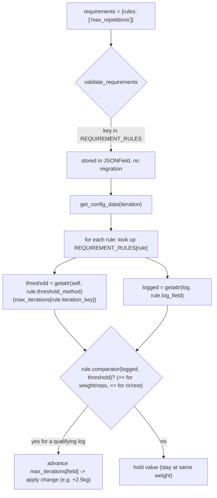
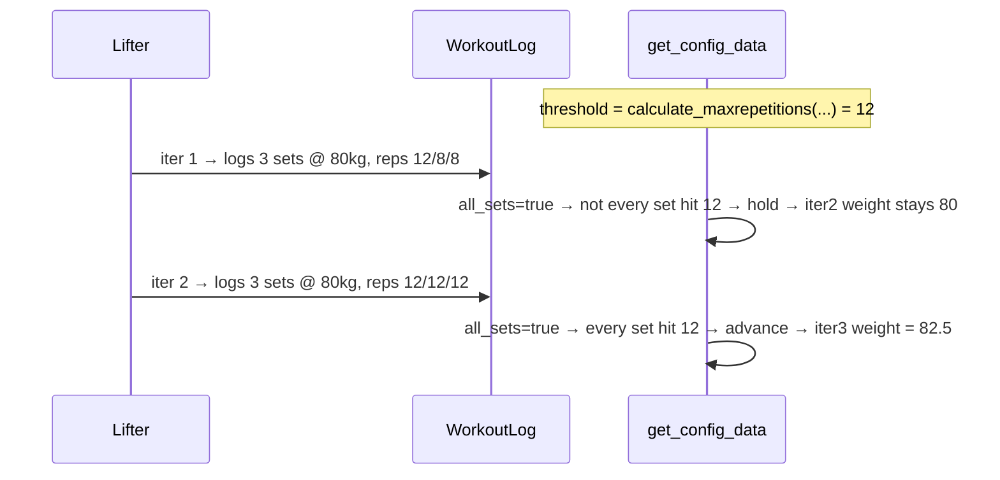

# Design Doc: First-Class "Double Progression" Support in the wger Routine Progression Engine

| Field        | Value                                                                 |
|--------------|-----------------------------------------------------------------------|
| **Title**    | First-class double-progression support via `max_*` requirement rules  |
| **Author**   | _<your name here>_                                                     |
| **Date**     | 2026-06-12                                                             |
| **Status**   | Draft                                                                  |
| **Target repo** | `wger-project/wger` (AGPL-3.0), backend; consumed by `wger-project/react` and the Flutter app |
| **Affected area** | `wger/manager` — flexible-routine progression engine             |
| **Related prior art** | GH issue #848 "support lifting programs", #2041 "progression work" |

---

## Overview

wger's flexible-routine engine recalculates each slot entry's prescription (weight, reps,
RiR, rest, sets) per *iteration* (a training session for that day). A change (e.g. "+2.5 kg")
can be gated by a `requirements` rule set so it only applies once the lifter has hit a target
in the previous iteration's logs. Today the only rep-based gate is `repetitions`, which checks
the logged reps against `calculate_repetitions()` — the **bottom** of the prescribed rep range.

That makes the single most popular intermediate progression scheme — **double progression**
("hold the weight, add reps until you reach the *top* of the range on your work sets, then add
weight and drop back down") — impossible to express. The fix is to introduce `max_*`
requirement rule keys (primarily `max_repetitions`) that read the **logged** value of a field
but compare it against the **top-of-range** calculator (`calculate_maxrepetitions()`). This is a
pure backend behavior addition over a `JSONField`, so it needs **no database migration** and is
**fully backward compatible**.

The design also fixes a latent key-naming bug discovered in `get_config_data()` that currently
prevents `max_*` config progressions from advancing past iteration 1 (see
[§ Discovered latent bug](#discovered-latent-bug-max_-iteration-keys)).

---

## Background & Motivation

### Current state

The engine lives in `wger/manager/models/slot_entry.py`, method
`SlotEntry.get_config_data(iteration)` ([slot_entry.py:349](/home/magma/Projects/wger/wger/manager/models/slot_entry.py)).
For every iteration `i` it:

1. Loads the "active" config for each field via `load_all_configs(i)['last']`
   ([slot_entry.py:243](/home/magma/Projects/wger/wger/manager/models/slot_entry.py)).
2. If a config has no `requirements`, it advances that field's progression pointer
   (`max_iterations[field] = i`).
3. If it has `requirements`, it computes a *threshold* per required field via
   `calculate_<req_field>(...)` and checks the previous iteration's `WorkoutLog` rows. If any log
   satisfies **all** required fields, it advances the pointer.

The valid rule keys are hard-coded in `wger/manager/api/validators.py`
([validators.py:23-28](/home/magma/Projects/wger/wger/manager/api/validators.py)):

```python
REQUIREMENTS_RULES_KEYS = ['weight', 'repetitions', 'rir', 'rest']
```

A rep *range* is two configs on the same slot entry:
`RepetitionsConfig` (bottom, e.g. 8) → `calculate_repetitions()`, and
`MaxRepetitionsConfig` (top, e.g. 12) → `calculate_maxrepetitions()`
([slot_entry.py:565-579](/home/magma/Projects/wger/wger/manager/models/slot_entry.py)).

### The gap

The inner gate ([slot_entry.py:413-424](/home/magma/Projects/wger/wger/manager/models/slot_entry.py)):

```python
def _requirement_met(log: WorkoutLog, field_name: str) -> bool:
    log_value = getattr(log, field_name, None)        # logged value
    if log_value is None:
        return False
    min_value = min_values.get(field_name)            # threshold = calculate_<field_name>(...)
    if min_value is None:
        return False
    return log_value >= min_value
```

With `rules: ["repetitions"]`, the threshold is `calculate_repetitions(...)` = the *bottom* of the
range (8). So a `WeightConfig` `+2.5 kg` fires the moment the lifter logs 8 reps — never letting
them work up to 12. There is **no** `max_repetitions` rule key, even though
`calculate_maxrepetitions()`, `calculate_maxweight()`, `calculate_maxrir()`,
`calculate_maxrest()`, `calculate_maxsets()` all already exist
([slot_entry.py:541-613](/home/magma/Projects/wger/wger/manager/models/slot_entry.py)).

### Why it matters

Double progression is a canonical, widely-recommended scheme for intermediate lifters (e.g.
"3×8–12: add weight when you hit 3×12"). Its absence is a real feature gap rather than a niche
request, and the calculator plumbing for the top-of-range values already exists — only the *gate*
is missing.

### Critical subtlety

A `WorkoutLog` row stores exactly **one** actual value per field: `log.repetitions`,
`log.weight`, `log.rir`, `log.rest` ([log.py:120-215](/home/magma/Projects/wger/wger/manager/models/log.py)).
There is **no** `log.max_repetitions` column. Today's `_requirement_met` does
`getattr(log, field_name)`, so a naive `max_repetitions` rule would call
`getattr(log, 'max_repetitions')` → `None` → always `False`. The design therefore must
**decouple** the rule key from (a) the log attribute it reads and (b) the threshold calculator it
compares against.

---

## Goals & Non-Goals

### Goals

- **G1** Add a `max_repetitions` requirement rule key whose semantics are: "apply this change only
  when the *logged* reps reached the *top* of the prescribed rep range." The end-to-end product
  experience (via the "Double progression" preset, G8) must deliver the canonical *all work sets*
  interpretation — i.e. weight advances only when **every** logged set hit the top (`3×12`), not
  merely one set.
- **G2** Generalize the gate so any rule key maps cleanly to `(log_field, threshold_calculator,
  iteration_pointer, comparator)` via a single declarative table — no `getattr` hacks, one source of
  truth.
- **G3** Add `max_weight`, `max_rir`, `max_rest` for symmetry, each with the **correct comparator
  direction** — `>=` for weight (more is harder), `<=` for RiR/rest (lower is harder) — rather than a
  symmetric `>=` shortcut (OQ-2).
- **G4** Zero schema migration; full backward compatibility for existing `repetitions`/`weight`
  rules. (The `rir`/`rest` comparator correction is a deliberate, isolated behavior change — see
  G9.)
- **G5** Fix the latent `max_*` iteration-key mismatch bug uncovered during this work.
- **G6** Define the API/serializer/OpenAPI contract and the front-end (React/Flutter) UX contract,
  including an optional higher-level "double progression" preset.
- **G7** Comprehensive unit tests covering multi-set, partial-completion, missing-log, and
  deload-on-stall edge cases.
- **G8** Ship an `all_sets` matching modifier in the **core** work (engine + validator + dataclass)
  so the canonical "all **N prescribed** sets reach the top" semantics are available immediately
  (gated on `calculate_sets(...)`, not on how many sets the user happened to log), and have the
  "Double progression" preset emit it by default. The raw engine default remains "any log" for
  backward compatibility (G4).
- **G9** Correct the existing `rir`/`rest` requirement comparator from the hard-coded `>=` to `<=`
  ("lower is harder"), shipped as an isolated, separately-revertible PR with updated tests and a
  changelog note (OQ-2).

### Non-Goals

- **NG1** Implementing the React/Flutter UI in this repo (separate repos; we specify the contract).
- **NG2** Auto-resetting the displayed rep target after a weight bump (wger intentionally does not
  do this; see [§ Edge cases](#edge-cases--semantics)). Out of scope to change.
- **NG3** Adding a `max_sets` rule — there is no per-log "sets" value to compare against (sets are
  represented as a count of log rows), so it has no clean semantics. Excluded.
- **NG4** Changing the *raw engine default* from "any log satisfies" to "all sets satisfy". The
  default stays "any" for backward compatibility; the stricter behavior is delivered through the
  opt-in `all_sets` modifier (shipped in core PR-2) and is what the preset writes. We are **not**
  silently flipping the default for existing `repetitions`-rule routines.
- **NG5** New per-config DB fields, RPE math changes, or custom `class_name` calculators.

---

## Proposed Design

### High-level

Introduce a single declarative mapping — `REQUIREMENT_RULES` — that, for each rule key, records:

1. `log_field` — the `WorkoutLog` attribute holding the **logged** value to test.
2. `threshold_method` — the `SlotEntry` method computing the **prescribed** threshold.
3. `iteration_key` — the key in `max_iterations` tracking that threshold's own progression.

Both the validator (allowed keys) and the engine (gate logic) derive from this one table.



### The rule table

Defined once in `wger/manager/consts.py`
([consts.py](/home/magma/Projects/wger/wger/manager/consts.py)) — a dependency-free leaf module
(zero imports) that is already imported by both the engine (`slot_entry.py`) and `dataclasses.py`.
Putting strings-only rule metadata here gives a single source of truth shared by the validator and
the engine while keeping the validator free of any `models/` import. To be precise: there is no
*direct* cycle today (`validators.py` imports only `rest_framework`, and no model imports
`validators`), but importing `models.slot_entry` from `validators` would be fragile during app
loading — `serializers.py` imports `validators` (line 22) *before* `models` (line 23), and
`slot_entry.py` does a self-referential package import `from wger.manager.models import WorkoutLog`
([slot_entry.py:48](/home/magma/Projects/wger/wger/manager/models/slot_entry.py)), so an eager
`models` import from `validators` risks a partial-import during startup. The dependency-free
`consts.py` sidesteps that entirely. The table holds **strings only** (method names), so it
introduces no model dependency.

```python
# wger/manager/consts.py  (new)
import operator
from collections import namedtuple

RequirementRule = namedtuple(
    'RequirementRule',
    ['log_field', 'threshold_method', 'iteration_key', 'comparator'],
)

# Single source of truth for requirement rule keys.
#   log_field        – attribute on WorkoutLog holding the *logged* value
#   threshold_method – SlotEntry method computing the *prescribed* threshold
#   iteration_key    – key in `max_iterations` tracking that threshold's progression
#   comparator       – how the logged value is tested against the threshold:
#                        operator.ge  → "logged >= threshold" (more is harder: weight, reps)
#                        operator.le  → "logged <= threshold" (lower is harder: RiR, rest)
REQUIREMENT_RULES: dict[str, RequirementRule] = {
    'weight':          RequirementRule('weight',      'calculate_weight',         'weight',          operator.ge),
    'repetitions':     RequirementRule('repetitions', 'calculate_repetitions',    'repetitions',     operator.ge),
    'rir':             RequirementRule('rir',         'calculate_rir',            'rir',             operator.le),
    'rest':            RequirementRule('rest',        'calculate_rest',           'rest',            operator.le),
    'max_weight':      RequirementRule('weight',      'calculate_maxweight',      'max_weight',      operator.ge),
    'max_repetitions': RequirementRule('repetitions', 'calculate_maxrepetitions', 'max_repetitions', operator.ge),
    'max_rir':         RequirementRule('rir',         'calculate_maxrir',         'max_rir',         operator.le),
    'max_rest':        RequirementRule('rest',        'calculate_maxrest',        'max_rest',        operator.le),
}

REQUIREMENTS_RULES_KEYS = list(REQUIREMENT_RULES.keys())
```

**Comparator direction (OQ-2, decided).** For `weight`/`repetitions` and their `max_*` variants,
*more is better/harder*, so a requirement is met when `logged >= threshold` (`operator.ge`). For
**RiR** (reps-in-reserve) and **rest**, *lower is harder* — you progress when the set got harder, i.e.
when the logged value **dropped to/below** the target — so these use `operator.le` (`logged <=
threshold`). The comparator lives in the table (not hard-coded in `_requirement_met`), so each rule
carries its own direction. This applies to the **plain `rir`/`rest` keys too**, which is a deliberate
**behavior change** from today's hard-coded `>=`; see the
[backward-compatibility note](#backward-compatibility-rirrest-comparator-flip) below and its dedicated
PR.

Note the resolution of the **underscore mismatch** the task flagged: the *public rule key* is
`max_repetitions` (underscore, consistent with the API's `max_repetitions_configs` serializer
field and the dataclass field `SetConfigData.max_repetitions`), while the *method name* is the
existing `calculate_maxrepetitions` (no underscore). The table maps one to the other explicitly,
so we do **not** rename any existing method and do **not** rely on `f'calculate_{rule}'` string
construction.

#### Backward-compatibility: `rir`/`rest` comparator flip

Today's `_requirement_met` hard-codes `log_value >= min_value`
([slot_entry.py:413-424](/home/magma/Projects/wger/wger/manager/models/slot_entry.py)), so the
**existing** `rir` and `rest` rules currently mean "logged value **≥** target". This is not just
theoretical — it is the *tested, documented* behavior:
[`test_requirements_sets_met`](/home/magma/Projects/wger/wger/manager/tests/test_slot_entry.py)
(line 329) prescribes `rest=90`, logs `rest=100`, and asserts the requirement is **met** (sets
increase); [`test_requirements_sets_unmet`](/home/magma/Projects/wger/wger/manager/tests/test_slot_entry.py)
(line 409) logs `rest=80` and asserts it is **not** met. In other words, the current `rest` rule
encodes "you rested **at least** the prescribed time" — a *minimum-recovery* gate.

The OQ-2 decision reinterprets `rir`/`rest` as "lower is harder → progress when the logged value
dropped to/below target", i.e. `<=`. Under `<=`, those two existing tests **invert**: `rest=100 ≤ 90`
is `False` (now unmet) and `rest=80 ≤ 90` is `True` (now met). So this is a genuine **behavior
change** for any routine that already uses a `rir` or `rest` requirement, not a purely additive one.
We are honest that some users may have relied on the old "minimum rest" reading; the OQ-2 decision is
that the "lower is harder" semantics is the correct/intended one, so we treat the old `>=` as a
**semantic defect to correct**, not preserve.

**Safe approach (the comparator work is therefore split across two PRs):**

1. **PR-3 (purely additive, non-breaking):** introduce the `comparator` field and the per-rule
   dispatch in `_requirement_met`, and add the **new** `max_rir`/`max_rest` keys with `operator.le`.
   In this PR the *legacy* `rir`/`rest` keys keep `operator.ge`, so **no existing behavior changes** —
   the infrastructure lands first, risk-free. New keys are new, so `<=` for them breaks nothing.
2. **PR-4 (isolated behavior change):** flip the legacy `rir`/`rest` entries from `operator.ge` to
   `operator.le`. This is the *only* commit that changes existing behavior, so it is independently
   reviewable, independently revertible, and easy to call out in the changelog. It updates
   `test_requirements_sets_met` / `test_requirements_sets_unmet` to the corrected `<=` semantics and
   adds explicit regression tests. **No DB migration** (the stored JSON `{'rules': ['rest']}` is
   unchanged; only the comparator the engine applies changes). Recommended companion: a release-notes
   entry and an optional read-only management command that lists `SlotEntry` configs whose
   `requirements.rules` contain `rir`/`rest` so affected users can be notified. Adoption is likely
   low — these rules ship with the recent flexible-routines work (migration `0018`).

(The final-state table above shows all four of `rir`/`rest`/`max_rir`/`max_rest` at `operator.le`,
which is the end state after PR-4; PR-3 lands everything except the two legacy flips.)

### Discovered latent bug: `max_*` iteration keys

While verifying the engine, I found a pre-existing inconsistency. `max_iterations` is keyed with
**underscores** ([slot_entry.py:400-411](/home/magma/Projects/wger/wger/manager/models/slot_entry.py)):

```python
max_iterations = {'weight': 1, 'max_weight': 1, 'repetitions': 1, 'max_repetitions': 1, ...}
```

but `load_all_configs()` returns config dict keys **without** underscores
([slot_entry.py:246-261](/home/magma/Projects/wger/wger/manager/models/slot_entry.py)):
`'weight', 'maxweight', 'repetitions', 'maxrepetitions', ...`. The advancement loop does
`max_iterations[field] = i` with `field` coming from that dict
([slot_entry.py:433-440](/home/magma/Projects/wger/wger/manager/models/slot_entry.py)), so it
writes `max_iterations['maxweight']` while the final read uses `max_iterations['max_weight']`
([slot_entry.py:477-489](/home/magma/Projects/wger/wger/manager/models/slot_entry.py)):

```python
max_weight = self.calculate_maxweight(max_iterations['max_weight'])  # always reads the seed value 1
```

Consequence: **a progressing `Max*Config` (e.g. a widening rep range) never advances past
iteration 1.** Crucially, this is **not** limited to the requirements path: it also affects the
**unconditional** advance branch (configs with *no* `requirements` at all), because that branch uses
the same mis-keyed `field` variable
([slot_entry.py:440](/home/magma/Projects/wger/wger/manager/models/slot_entry.py)). So **any**
progressing `MaxRepetitionsConfig` / `MaxWeightConfig` / `MaxRiRConfig` / `MaxRestConfig` /
`MaxSetsConfig` is stuck at its iteration-1 value in `get_config_data` output, regardless of whether
requirements are involved — the full blast radius is "all `Max*Config` progression output." For the
common double-progression case (a *static* top-of-range, e.g. a flat 12) the value at iteration 1 is
already correct, so the bug is invisible there — which is why it has gone unnoticed. But our
`max_repetitions` gate also reads `max_iterations['max_repetitions']` to size the threshold, so we
must make this robust.

**Fix:** normalize on the underscored keys end to end. Map the `load_all_configs` dict keys to the
`max_iterations` keys with a tiny lookup so the advancement loop writes the same key the final read
uses:

```python
# field key from load_all_configs() -> max_iterations key
ITERATION_KEY = {
    'weight': 'weight', 'maxweight': 'max_weight',
    'repetitions': 'repetitions', 'maxrepetitions': 'max_repetitions',
    'rir': 'rir', 'maxrir': 'max_rir',
    'rest': 'rest', 'maxrest': 'max_rest',
    'sets': 'sets', 'maxsets': 'max_sets',
}
```

and use `max_iterations[ITERATION_KEY[field]] = i` at **both** advancement sites (the requirement-free
branch at [slot_entry.py:440](/home/magma/Projects/wger/wger/manager/models/slot_entry.py) and the
requirement-gated branch at line 473) — both share the same `field` variable, so the single mapping
fixes both. This is shipped as its own small, independently-reviewable PR (PR-1) with dedicated
regression tests, *before* the feature lands on top of it.

### Engine changes (`get_config_data` / `_requirement_met`)

**Before** ([slot_entry.py:413-463](/home/magma/Projects/wger/wger/manager/models/slot_entry.py)):

```python
def _requirement_met(log: WorkoutLog, field_name: str) -> bool:
    log_value = getattr(log, field_name, None)
    if log_value is None:
        return False
    min_value = min_values.get(field_name)
    if min_value is None:
        return False
    return log_value >= min_value
...
min_values: Dict[str, Decimal | None] = {}
for req_field in requirements.rules:
    calc_fn = getattr(self, f'calculate_{req_field}', None)
    if not callable(calc_fn):
        logger.error(f'Missing method calculate_{req_field} ...')
        min_values[req_field] = None
        continue
    try:
        min_values[req_field] = calc_fn(max_iterations[req_field])
    except Exception as e:
        ...
```

**After:**

```python
from wger.manager.consts import REQUIREMENT_RULES

def _requirement_met(log: WorkoutLog, rule_key: str) -> bool:
    """True if this log satisfies the named requirement rule."""
    rule = REQUIREMENT_RULES[rule_key]                 # validated upstream; always present
    log_value = getattr(log, rule.log_field, None)     # e.g. 'repetitions' for 'max_repetitions'
    if log_value is None:
        return False
    threshold = min_values.get(rule_key)
    if threshold is None:
        return False
    # Per-rule direction: operator.ge for weight/reps (more is harder),
    # operator.le for rir/rest (lower is harder).
    return rule.comparator(log_value, threshold)
...
min_values: Dict[str, Decimal | None] = {}
for rule_key in requirements.rules:
    rule = REQUIREMENT_RULES.get(rule_key)
    if rule is None:                                   # defence-in-depth (validator already gates)
        # warning + throttled: this fires in bulk only after a PR-2 rollback (stored max_* rules
        # become unknown). _log_unknown_rule_once de-dupes per (slot_entry, rule_key) per process.
        _log_unknown_rule_once(self.id, rule_key)
        min_values[rule_key] = None
        continue
    calc_fn = getattr(self, rule.threshold_method, None)
    if not callable(calc_fn):
        logger.error(f'Missing method {rule.threshold_method} on SlotEntry {self.id}')
        min_values[rule_key] = None
        continue
    try:
        min_values[rule_key] = calc_fn(max_iterations[rule.iteration_key])
    except Exception as e:
        logger.error(f'Error during {rule.threshold_method} for SlotEntry {self.id}: {e}')
        min_values[rule_key] = None
```

The outer matching loop keeps its shape
([slot_entry.py:467-474](/home/magma/Projects/wger/wger/manager/models/slot_entry.py)) but gains an
`all_sets` branch. By default (`all_sets=False`) it advances on the **first** qualifying log
(backward-compatible "any"); when `requirements.all_sets` is set it advances only when the lifter
**completed at least the prescribed number of sets** *and* **every logged set** for this slot entry
met all rules. The set count comes from `calculate_sets(...)` (the *prescribed* count), **not** from
the length of `log_data` (the *logged* count) — otherwise under-logging would advance prematurely
(see [Edge cases §1](#edge-cases--semantics)):

```python
requirements = config.requirements_object
...
if requirements.all_sets:
    # Strict double progression ("all N prescribed sets at the top"):
    #   (1) the lifter logged at least the prescribed number of sets for the prior iteration, AND
    #   (2) every logged set for this slot entry met all rules.
    # calculate_sets(i - 1) is the prescribed count for the iteration the logs belong to;
    # default to 1 (mirroring get_config_data's own `sets if sets is not None else 1`).
    prescribed_sets = self.calculate_sets(i - 1) or 1
    if len(log_data) >= prescribed_sets and all(
        all(_requirement_met(log, rule_key) for rule_key in requirements.rules)
        for log in log_data
    ):
        max_iterations[ITERATION_KEY[field]] = i
else:
    for log in log_data:                       # "any" — first qualifying log advances (existing)
        if all(_requirement_met(log, rule_key) for rule_key in requirements.rules):
            max_iterations[ITERATION_KEY[field]] = i
            break
```

The `len(log_data) >= prescribed_sets` clause subsumes the empty-log guard (with `prescribed_sets ≥ 1`,
an empty `log_data` gives `0 >= 1 → False`, so a missing-log iteration never advances — this also
sidesteps the vacuous `all([])` trap). `log_data` is already scoped to the prior iteration's logs for
**this** slot entry (`log.slot_entry_id == self.id`,
[slot_entry.py:429-431](/home/magma/Projects/wger/wger/manager/models/slot_entry.py)), so warm-up
sets — which wger models as *separate* `SlotEntry` rows with `type='warmup'`
([slot_entry.py:164-169](/home/magma/Projects/wger/wger/manager/models/slot_entry.py)) — are
naturally excluded from the count and the threshold check.

`all_sets` is parsed by `ConfigRequirements`
([dataclasses.py:272-281](/home/magma/Projects/wger/wger/manager/dataclasses.py)), which currently
only reads `rules`:

```python
@dataclass(init=False)
class ConfigRequirements:
    rules: List[str] = field(default_factory=list)
    all_sets: bool = False                         # NEW

    def __init__(self, data: Dict[str, Any]):
        self.rules = data.get('rules', [])
        self.all_sets = bool(data.get('all_sets', False))   # NEW; defaults False (backward compatible)
```

### Worked example: `3×8–12, +2.5 kg at the top`

Configs on a slot entry:
- `SetsConfig(value=3)`, `RepetitionsConfig(value=8)`, `MaxRepetitionsConfig(value=12)`,
  `WeightConfig(iteration=1, value=80)`.
- `WeightConfig(iteration=2, value=2.5, operation=+, repeat=True,
  requirements={'rules': ['max_repetitions'], 'all_sets': true})`  ← what the preset writes.



**Contrast of the two matching policies on the iter-1 logs `12/8/8`:**

| Requirements | iter-1 result | Matches "3×12"? |
|--------------|---------------|------------------|
| `{'rules': ['repetitions']}` (old, bottom of range) | advances (8 ≥ 8) | no — bumps far too early |
| `{'rules': ['max_repetitions']}` (raw default, "any") | **advances** (one set hit 12) | no — weaker than `3×12` |
| `{'rules': ['max_repetitions'], 'all_sets': true}` (preset) | holds (only one set hit 12) | **yes** |

So the *raw* `max_repetitions` rule under the default "any" policy still advances on `12/8/8`, which
is weaker than the canonical "all work sets at the top". That is why the **"Double progression"
preset always emits `all_sets: true`** — the experience users actually receive matches the `3×12`
intent, while the engine's permissive default is preserved for backward compatibility and for power
users who explicitly want "any".

---

## API / Interface Changes

### Validator (`wger/manager/api/validators.py`)

**Before** ([validators.py:23-28](/home/magma/Projects/wger/wger/manager/api/validators.py)):

```python
REQUIREMENTS_RULES_KEYS = ['weight', 'repetitions', 'rir', 'rest']
```

**After** — import the single source of truth so the two never drift:

```python
from wger.manager.consts import REQUIREMENTS_RULES_KEYS  # derived from REQUIREMENT_RULES
```

`validate_requirements` ([validators.py:31-48](/home/magma/Projects/wger/wger/manager/api/validators.py))
still rejects any rule not in `REQUIREMENTS_RULES_KEYS` with `Invalid rule: <x>`; new keys are simply
now accepted. It also gains one small addition (PR-2): accept an optional boolean `all_sets`, e.g.

```python
if 'all_sets' in value and not isinstance(value['all_sets'], bool):
    raise serializers.ValidationError("'all_sets' must be a boolean.")
```

Omitting `all_sets` preserves today's payloads exactly (it defaults to `False`).

### Serializer / REST surface

`requirements` is exposed via `BaseConfigSerializer.requirements`
([serializers.py:103-107](/home/magma/Projects/wger/wger/manager/api/serializers.py)) as a
`JSONField(validators=[validate_requirements])`, included in every config serializer through
`BASE_CONFIG_FIELDS` ([consts.py:11](/home/magma/Projects/wger/wger/manager/api/consts.py)). Because
validation flows through the same `validate_requirements`, **no serializer code changes are
required** — the new keys are accepted automatically across `WeightConfig`, `RepetitionsConfig`,
etc. endpoints.

The computed prescription returned to clients (`SetConfigData` →
[dataclasses.py:49-76](/home/magma/Projects/wger/wger/manager/dataclasses.py)) is **unchanged** in
shape: it already carries both `repetitions` and `max_repetitions`. Only the *value* of `weight`
changes (it now waits longer to bump). No new response fields.

### OpenAPI schema

> **Assumed, to be confirmed in CI / the schema build** (not independently verified from this
> backend checkout): the exact `drf-spectacular` output shape for the `requirements` JSONField.

The project uses `drf-spectacular`. Because `requirements` is a free-form `JSONField`, the generated
schema is expected to describe it as a generic object that does **not** enumerate rule keys.
Recommended improvement (optional, in PR-3): attach an `@extend_schema_field` / `OpenApiExample`
documenting the accepted `rules` enum (now including `max_*`) and the `all_sets` boolean so the
contract is discoverable by the React/Flutter codegen. No breaking schema change.

### Before/after request example

```jsonc
// Old (bottom-of-range gate): bumps weight as soon as 8 reps are hit
PATCH /api/v2/weightconfig/{id}/
{ "requirements": { "rules": ["repetitions"] } }

// New (double progression, what the preset writes): bumps weight only when ALL sets hit 12 reps
PATCH /api/v2/weightconfig/{id}/
{ "requirements": { "rules": ["max_repetitions"], "all_sets": true } }
```

---

## Data Model Changes

**None.** `requirements` is a `JSONField` on the abstract base `AbstractChangeConfig`
([abstract_config.py:104-116](/home/magma/Projects/wger/wger/manager/models/abstract_config.py)),
inherited by all `*Config` models. New rule strings are just new JSON payloads. **No migration is
required** — confirmed by inspecting the field definition and the fact that
`migrations/0018_flexible_routines.py` already created it as JSON.

The new `all_sets` modifier is likewise just an extra key inside the same `requirements` JSON
object — **no migration**, and absent `all_sets` defaults to `False` (today's behavior).

Backward compatibility: existing rows with `{'rules': ['repetitions']}` / `{'rules': ['weight']}`
(and friends) keep their exact meaning because those keys remain in the table with identical
`(log_field, threshold_method, comparator=operator.ge)`, and they carry no `all_sets` key so they
retain the "any log" matching. **One deliberate exception:** the `rir` and `rest` keys change
comparator from `>=` to `<=` (OQ-2 decision) — a *behavior* change for those two rules, isolated in
PR-4. It is still **migration-free** (the stored JSON is untouched; only the comparator the engine
applies changes); see
[§ Backward-compatibility: `rir`/`rest` comparator flip](#backward-compatibility-rirrest-comparator-flip).

---

## Alternatives Considered

### Alt 1 — Add a `MaxRepetitions`-backed log column and use `getattr(log, 'max_repetitions')`

Add `log.max_repetitions` and keep the naive `getattr(log, rule_key)`.
**Rejected.** Requires a DB migration and a semantic invention (a log row represents *one* set;
there is no separate "max" actual value to record). It also pollutes the log model and every
serializer/app for no benefit. The rule key → `log_field` mapping achieves the same with zero
schema change.

### Alt 2 — Generic `getattr(self, f'calculate_max{rule}')` string munging

Keep the existing `f'calculate_{req_field}'` style and special-case a `max` prefix.
**Rejected.** Fragile and implicit: it re-creates the exact underscore/no-underscore mismatch
(`max_repetitions` rule vs `calculate_maxrepetitions` method) the task calls out, hides the
log-field-vs-threshold decoupling, and spreads the contract across string concatenation. The
declarative `REQUIREMENT_RULES` table is explicit, testable, and the single source of truth shared
by the validator.

### Alt 3 — A dedicated boolean `double_progression` field on the config

Add a model flag instead of a rule key.
**Rejected.** Less composable (rules already combine, e.g. `['max_repetitions', 'rir']`), needs a
migration, and duplicates a mechanism that already exists. The `max_*` rule key slots into the
established `requirements` system and is strictly more general.

| Option | Migration | Backward compat | Composable | Complexity | Verdict |
|--------|-----------|-----------------|------------|------------|---------|
| **Chosen: `max_*` rule keys + table** | none | full | yes | low | ✅ |
| Alt 1: new log column | yes | full | n/a | high | ❌ |
| Alt 2: string munging | none | full | yes | low but fragile | ❌ |
| Alt 3: boolean field | yes | full | no | medium | ❌ |

---

## Security & Privacy Considerations

- **Threat model is unchanged.** The feature only widens the *enum* of accepted strings in an
  already-validated, already-owned field. No new endpoints, no new PII.
- **Ownership.** Progression reads are already user-scoped:
  `get_config_data` filters logs by the routine owner
  ([slot_entry.py:371](/home/magma/Projects/wger/wger/manager/models/slot_entry.py)), and
  `WorkoutLog.save` rejects cross-user routine/slot_entry attachment
  ([log.py:250-256](/home/magma/Projects/wger/wger/manager/models/log.py)). Unchanged.
- **Input validation.** `validate_requirements` still rejects unknown keys, non-list `rules`, and
  non-dict payloads ([validators.py:31-48](/home/magma/Projects/wger/wger/manager/api/validators.py)),
  so the new keys cannot be used to inject arbitrary method names — the table is a closed
  allow-list; `threshold_method` strings are never user-supplied.
- **DoS / overflow.** Threshold computations reuse the existing `calculate_*` path, which clamps via
  `MAX_COMPOUND_VALUE` / `MAX_COMPOUND_RIR`
  ([abstract_config.py:35-39](/home/magma/Projects/wger/wger/manager/models/abstract_config.py)).
  No new unbounded loops.

---

## Observability

- **Logging.** Reuse the existing `logger` in `slot_entry.py`. The refactored threshold loop keeps
  the `logger.error(...)` calls for "missing method" and "calc error". The new "unknown requirement
  rule" defensive branch is logged at **`warning`** (not `error`) and should be **throttled** (e.g.
  emit at most once per `(slot_entry_id, rule_key)` per process, or rate-limited via a small LRU
  guard). Rationale: this branch is unreachable in normal operation (validator-gated), but it *is*
  reachable in bulk after a PR-2 rollback — every `get_config_data` call for a routine that saved a
  `max_*` rule would hit it. Throttled `warning` keeps it a useful canary for data/table drift
  without flooding the logs in the rollback scenario (see [§ Rollback](#rollout-plan)).
- **Metrics (optional, follow-up).** If the project tracks engine usage, add a counter for routines
  using `max_*` rules (a simple `Count` query in the existing stats job) to quantify adoption. Not
  required for correctness.
- **Cache.** Results are cached under `CacheKeyMapper.slot_entry_configs_key`
  ([slot_entry.py:362-365](/home/magma/Projects/wger/wger/manager/models/slot_entry.py)) and only
  short-circuited when `not self.has_progression`. Adding a rule does not change cache keys; existing
  invalidation on config/log writes still applies. No action needed, but call it out in the PR so
  reviewers verify no stale-cache regressions for changed routines.

---

## Rollout Plan

Most of this is additive and backward-compatible (no heavy flag needed); the one behavior change
(the `rir`/`rest` comparator flip) is isolated in its own PR. We stage it:

1. **PR-1 (bug fix):** normalize `max_*` iteration keys + regression test. Mergeable alone; makes
   the existing engine correct.
2. **PR-2 (core feature):** `REQUIREMENT_RULES` table in `consts.py`, validator derives keys, engine
   uses the table, add `max_repetitions` (+ `max_weight`) and the `all_sets` modifier. Full unit tests.
3. **PR-3 (comparator infra + symmetry + schema):** add the per-rule `comparator`; introduce
   `max_rir`/`max_rest` with `<=`; OpenAPI examples. **Additive — legacy `rir`/`rest` unchanged here.**
4. **PR-4 (isolated behavior change):** flip legacy `rir`/`rest` to `<=` with updated tests + changelog.
5. **PR-5 (front-end contract):** React preset/toggle (separate repo) — see below.

- **Feature flag:** not strictly needed server-side. If desired, gate the *UI* preset behind a
  React feature flag so the contract can soak before exposure. The backend simply accepts the keys.
- **Staged rollout:** deploy backend (PR-2/3) first; it is inert until a client sends a `max_*`
  rule. PR-4 (the `rir`/`rest` flip) ships with a changelog entry; consider running the read-only
  audit command first to gauge how many routines use `rir`/`rest` rules. Then ship the React UI (PR-5).
- **Rollback:** revert PR-2 restores `REQUIREMENTS_RULES_KEYS` to the old four. Any routine that had
  saved a `max_*` rule would then fail validation only on *re-save*; stored JSON is untouched and
  reads still work because the engine revert removes the keys from the table (those rules would be
  treated as unknown → threshold `None` → change simply never fires, i.e. weight holds — a safe,
  conservative failure mode, not a crash). **Trade-off to document in the PR:** unless the
  unknown-rule log branch is throttled (see [§ Observability](#observability)), this path generates
  sustained log volume — one line per affected routine per `get_config_data` call — for as long as
  those `max_*` rules remain stored. The throttled-`warning` design keeps rollback quiet; ship it as
  part of PR-2 so the safety net exists before the keys are ever exposed.

---

## Edge cases & semantics

1. **"Any set" vs "all sets" at the top (resolved in core PR-2).** The existing loop advances on the
   **first** log that satisfies all rules (`break` at
   [slot_entry.py:467-474](/home/magma/Projects/wger/wger/manager/models/slot_entry.py)). Canonical
   double progression wants **all work sets** to hit the top (`3×12`). We resolve this decisively:
   - The **raw engine default stays "any"** so existing `repetitions`-rule routines are never
     silently altered (backward compatibility, NG4).
   - The core PR-2 ships an opt-in `all_sets` modifier
     (`requirements = {'rules': ['max_repetitions'], 'all_sets': true}`; see
     [§ Engine changes](#engine-changes-get_config_data--_requirement_met)).
   - The **"Double progression" preset always emits `all_sets: true`**, so the experience delivered
     to users matches the `3×12` intent without requiring them to understand raw rule keys.

   **Precise definition of `all_sets`.** It means: *the lifter logged **at least the prescribed
   number of sets** (`calculate_sets(i-1)`, defaulting to 1) for this slot entry in the prior
   iteration, **and** every one of those logged sets met all rules.* We deliberately gate on the
   **prescribed** set count rather than the **logged** count (`len(log_data)`) so the rule faithfully
   encodes "completed all N prescribed sets at the top". This handles the two count-mismatch edges:
   - **Under-logging:** a lifter who logs only their two best sets `12/12` when `3×` is prescribed
     does **not** advance (`len(log_data)=2 < 3`), because they did not actually complete `3×12`.
   - **Over-logging:** an extra logged set below the top — e.g. a recorded back-off or a failed AMRAP
     against the same entry (`12/12/12/8`) — makes the `all(...)` over `log_data` `False`, so it
     **holds**. (Conversely, four genuine top sets `12/12/12/12` advance: `4 ≥ 3` and all meet the
     threshold.) This is a conscious choice: an extra sub-top set on the work exercise is a real
     signal the lifter is not yet owning the top of the range. Power users wanting looser behavior
     can drop `all_sets` and use the permissive "any" default.
   - **Warm-ups are not affected:** warm-up sets are separate `SlotEntry` rows (`type='warmup'`) and
     are filtered out by `log.slot_entry_id == self.id`, so they never count toward (or against) the
     work set's `all_sets` check.
   - **Caveat — `prescribed_sets` is the *ungated* count:** `calculate_sets(i-1)` applies all
     `SetsConfig` rows for that iteration with **no** requirement gating, whereas the engine's own
     final `sets` value uses the gated pointer (`calculate_sets(max_iterations['sets'])`). These are
     identical for the realistic case of a *static* sets count (e.g. `SetsConfig(value=3)`), which is
     what every worked example and test uses. They diverge only in the exotic combination of a
     *progressing* sets count that is itself *requirement-gated* alongside an `all_sets` weight
     progression on the same entry; there, `prescribed_sets` may be conservative (over-count → hold)
     by one increment — a fail-safe approximation we accept rather than couple the strict branch to
     the gated `max_iterations['sets']` pointer (which would add the intra-iteration ordering
     dependency discussed in [§7](#edge-cases--semantics) for negligible real-world benefit).

   This is no longer an open question; it is decided in PR-2.
2. **Partial completion / missing logs.** If no log for the prior iteration meets the threshold (or
   none exists), `_requirement_met` returns `False`, the pointer doesn't advance, and the weight
   **holds** — exactly the desired "stall" behavior. Covered by tests.
3. **Deload-on-stall.** wger has no automatic deload; a stall simply repeats the same prescription.
   If a user wants a deload after N stalls, that is a separate scheme (a future `class_name`
   calculator). Out of scope; documented so reviewers don't expect it.
4. **Interaction with `repeat=True`.** The `+2.5 kg` config typically uses `repeat=True` so it
   applies every iteration the requirement is met. `duplicate_configs`
   ([slot_entry.py:326-347](/home/magma/Projects/wger/wger/manager/models/slot_entry.py)) is
   orthogonal to requirements — it duplicates the change rule across iterations, while the
   requirement gate decides per-iteration whether the (possibly duplicated) change advances. Works
   unchanged; explicitly tested.
5. **Rep-range reset after a weight bump.** wger does **not** auto-reset the displayed reps back to
   the bottom after a weight increase — `calculate_repetitions` continues to return the configured
   bottom (e.g. 8) and the display shows the `8–12` range. This is **expected** and matches the
   "drop back down within the same range" mental model. We document it; we do **not** change it
   (NG2).
6. **RiR / rest direction (OQ-2, decided — proper inverted gate).** The comparator is **per-rule**,
   not hard-coded. For reps/weight (and their `max_*`), "more is harder/better", so the gate is
   `logged >= threshold` (`operator.ge`). For **RiR** (reps-in-reserve) and **rest**, *lower is
   harder*: you progress when the set got harder, i.e. when the logged value **dropped to/below** the
   target — so `rir`/`rest`/`max_rir`/`max_rest` use `logged <= threshold` (`operator.le`).
   Concretely, `max_rir` is met when the logged RiR fell to/under the top of the prescribed RiR range,
   and `max_rest` when the logged rest fell to/under the top of the rest range. Two consequences:
   - **This corrects the existing `rir`/`rest` rules**, which today use the hard-coded `>=` — a
     behavior change shipped in its own isolated PR-4 (see
     [§ Backward-compatibility](#backward-compatibility-rirrest-comparator-flip)).
   - For RiR/rest the *bottom*-of-range rule (`rir`/`rest`) is usually the meaningful progression gate
     (the hard end), while `max_rir`/`max_rest` exist for completeness/symmetry; both are wired
     correctly with `<=` regardless. We no longer use a symmetric `>=` shortcut.
7. **Intra-iteration ordering when the top-of-range is itself progressing.** Within a single
   iteration, `for field, config in configs.items()` processes `weight` *before* `maxrepetitions`
   (dict order from `load_all_configs`,
   [slot_entry.py:246-261](/home/magma/Projects/wger/wger/manager/models/slot_entry.py)). A
   `WeightConfig` gated by `max_repetitions` therefore computes its threshold as
   `calculate_maxrepetitions(max_iterations['max_repetitions'])` *before* the `maxrepetitions`
   field's own pointer has advanced for the current iteration. For a **static** top (the common
   double-progression case) this is harmless — the threshold is the same every iteration. For a
   **progressing** rep-range top (a widening range), the threshold the weight gate sees can **lag by
   one iteration**: it uses the previous iteration's range top. Note this is only meaningful *after*
   PR-1 fixes the iteration-key bug (before PR-1 the top never advances at all). We judge a
   one-iteration lag acceptable (it makes the gate slightly more conservative — it never bumps weight
   *too* eagerly), and we add an explicit test
   (`test_progressing_max_rep_top_with_weight_gate`) documenting the behavior so a future change to
   reorder the loop or pre-resolve thresholds is a conscious decision rather than an accidental
   regression.

---

## Testing Strategy

Existing coverage lives in
[`wger/manager/tests/test_slot_entry.py`](/home/magma/Projects/wger/wger/manager/tests/test_slot_entry.py)
(`test_weight_config_with_logs` at line 141; `test_requirements_sets_met` at 329;
`test_requirements_sets_unmet` at 409; `test_requirements_sets_null_values` at 486), plus
`test_set_config_data.py` and `test_change_config_model.py`. The fixture is
`wger/manager/fixtures/test-routine-data.json`. New tests mirror these patterns.

**Engine unit tests (PR-2),** in `test_slot_entry.py`:

- `test_max_repetitions_holds_until_top`: range 8–12, log 10 reps → weight holds; next iteration log
  12 → weight advances. (The headline double-progression case.)
- `test_max_repetitions_vs_repetitions`: identical setup, assert `repetitions` rule bumps at 8 while
  `max_repetitions` does not — pins the behavioral difference.
- `test_max_repetitions_any_policy_opt_out`: three logs (12/8/8), **no** `all_sets` →
  advances under the engine's permissive "any" default. Named to make clear this is testing the
  *non-strict opt-out*, **not** the headline `3×12` feature (which is the strict tests below).
- `test_max_repetitions_all_sets_strict_holds`: prescribed `3×`, three logs (12/8/8), `all_sets: true`
  → **holds** (not every set hit the top). This is the canonical "3×12" semantics the preset
  delivers.
- `test_max_repetitions_all_sets_strict_advances`: prescribed `3×`, three logs (12/12/12),
  `all_sets: true` → advances.
- `test_all_sets_under_logging_holds`: prescribed `3×`, only two logs (12/12), `all_sets: true` →
  **holds** (`len(log_data)=2 < calculate_sets=3`); confirms the gate keys off the *prescribed*
  count, not the *logged* count.
- `test_all_sets_over_logging_holds`: prescribed `3×`, four logs (12/12/12/8 — an extra back-off /
  failed set), `all_sets: true` → **holds** (the sub-top set fails the `all(...)`).
- `test_all_sets_over_logging_all_top_advances`: prescribed `3×`, four genuine top logs (12/12/12/12),
  `all_sets: true` → advances (`4 ≥ 3` and all meet the threshold).
- `test_all_sets_warmup_sets_excluded`: a `type='warmup'` `SlotEntry` logged at low reps in the same
  iteration does not affect the work entry's `all_sets` evaluation (separate `slot_entry_id`).
- `test_all_sets_empty_logs_no_advance`: `all_sets: true` with no logs for the prior iteration →
  holds (covered by `0 >= prescribed`, which also guards the vacuous-`all([])` trap).
- `test_max_repetitions_partial_no_advance`: three logs (11/11/11) below top → holds (both policies).
- `test_max_repetitions_missing_log`: no log for prior iteration → holds.
- `test_max_weight_symmetry`: `max_weight` rule reads `log.weight`, compares vs
  `calculate_maxweight`. See the concrete scenario in [PR Plan → PR-2](#pr-plan).
- `test_combined_rules`: `{'rules': ['max_repetitions', 'rir']}` requires both top reps **and** RiR
  threshold in the same log.
- `test_repeat_true_with_max_repetitions`: `repeat=True` change advances across multiple iterations
  only while the top is hit.
- `test_progressing_max_rep_top_with_weight_gate`: a *progressing* `MaxRepetitionsConfig` (widening
  range) combined with a `max_repetitions`-gated `WeightConfig` — documents the one-iteration
  threshold lag described in [Edge cases §7](#edge-cases--semantics).

**Comparator-direction tests (PR-3, additive),** in `test_slot_entry.py`:

- `test_max_rir_dropped_below_advances`: prescribed RiR range with a `max_rir`-gated change; a log
  whose `rir` fell to/under the top of the range → advances (`operator.le`). A log with `rir` above
  the top → holds.
- `test_max_rest_dropped_below_advances`: analogous for `max_rest` (logged rest ≤ top of rest range →
  advances; above → holds).
- `test_comparator_table_directions`: a table-level unit test asserting
  `REQUIREMENT_RULES['repetitions'].comparator is operator.ge` and
  `REQUIREMENT_RULES['max_rir'].comparator is operator.le`, pinning the direction per key so an
  accidental edit is caught.

**Legacy `rir`/`rest` comparator-flip tests (PR-4, behavior change),** in `test_slot_entry.py`:

- **Update** the existing `test_requirements_sets_met` / `test_requirements_sets_unmet` (lines 329 /
  409) to the corrected `<=` semantics: with `rest=90` prescribed, a logged `rest=80` (≤ 90) now
  **meets** the requirement (sets increase) and `rest=100` (> 90) now **does not**. The test bodies
  invert relative to today; the diff is the visible record of the behavior change.
- `test_rir_rule_dropped_below_advances`: a `rir`-gated change advances when the logged RiR fell
  to/under the prescribed RiR (≤), and holds when it stayed above.

**Regression tests (PR-1),** in `test_slot_entry.py`:

- `test_max_config_progression_advances_no_requirements`: a progressing `MaxRepetitionsConfig`
  (e.g. 12 → 14 at iter 3) with **no requirements** is reflected in `get_config_data`'s
  `max_repetitions` output. This is the *simplest* repro of the latent bug (the unconditional advance
  branch) — fails on `master`, passes after the key normalization.
- `test_max_config_progression_advances_with_requirements`: same, but with a gated `Max*Config`, to
  cover the requirement-gated advance branch too.

**Validator accept/reject tests (PR-2/3) — at the serializer layer, not the model layer.**
`validate_requirements` is a **serializer-level** validator
([serializers.py:103-107](/home/magma/Projects/wger/wger/manager/api/serializers.py)); it is **not**
invoked by model `save()`, so a model can persist `{'rules': ['bogus']}` without error and a
model-level rejection test would pass for the wrong reason. These tests therefore either (a) call
`validate_requirements(...)` directly and assert `serializers.ValidationError`, or (b) exercise a
DRF config serializer's `is_valid()` / an API `POST`/`PATCH` request. Suggested home: a new
`test_requirements_validator.py` (or the API test suite), **not** `test_change_config_model.py`.
Cases: accepts `{'rules': ['max_repetitions']}`, accepts `{'rules': ['max_repetitions'],
'all_sets': true}`, accepts `{'rules': ['max_rir']}` / `{'rules': ['max_rest']}` (PR-3),
rejects `{'rules': ['max_sets']}`, rejects a bogus key, rejects
`{'rules': ['max_repetitions'], 'all_sets': 'yes'}` (non-boolean).

`test_change_config_model.py` stays scoped to the `ConfigRequirements` dataclass /
`requirements_object` property (existing tests at lines 33-63), extended with a case asserting
`ConfigRequirements({'rules': ['max_repetitions'], 'all_sets': True}).all_sets is True` and that the
default is `False`.

Run locally with `python -m pytest wger/manager/tests/test_slot_entry.py` (or
`./manage.py test wger.manager`), matching the repo's existing harness.

---

## Front-end & Mobile contract (consumers)

> **Assumed, to be confirmed in the consumer repos** (separate `wger-project/react` and Flutter
> checkouts; not verifiable from this backend repo): the exact component paths below, and the claim
> that both front-ends currently round-trip `requirements` opaquely. The backend `requirements`
> field, serializer plumbing, and `SetConfigData` shape **were** verified here.

The React editor lives in `wger-project/react`
(`src/components/WorkoutRoutines/...`, mirroring `SlotEntry.ts`); the Flutter app
(`lib/models/workouts/slot_entry.dart`) consumes the same REST API. Both are assumed to already
round-trip the `requirements` JSON opaquely.

**Contract (no breaking change):** clients may now send `max_*` keys inside `requirements.rules`.

**UX recommendation:** rather than exposing raw rule keys (`max_repetitions`) to end users, offer a
higher-level **"Double progression"** preset/toggle on the weight progression rule that:

- writes `requirements = {'rules': ['max_repetitions'], 'all_sets': true}` on the relevant
  `WeightConfig` (strict "all work sets at the top" / `3×12` semantics), and
- **auto-creates the rep-range top (OQ-3, decided).** If the slot entry has no `MaxRepetitionsConfig`,
  the preset **creates one** rather than refusing or making the user define a range first. The
  default top is **`RepetitionsConfig.value + 4`** (e.g. bottom `8` → top `12`, the textbook
  `8–12` range), created at `iteration=1` (baseline, `operation=replace`), rounded to the entry's
  `repetition_rounding`. The `+4` default is a starting point the user can immediately edit in the
  same editor. Rationale: double progression is *meaningless* without a range top, so the preset
  owning that creation removes a confusing dead-end where applying the preset would otherwise appear
  to do nothing. (If a `MaxRepetitionsConfig` already exists, the preset leaves it untouched.)
  Edge case: if the entry has no `RepetitionsConfig` either, the preset first creates a sensible
  bottom (the React app's existing default rep target) and then `bottom + 4` as the top.

**Backend impact of OQ-3: none beyond what already exists.** Creating a `MaxRepetitionsConfig` uses
the existing `MaxRepetitionsConfigSerializer` / endpoint already wired through
`max_repetitions_configs` ([serializers.py:140-147, 218-220](/home/magma/Projects/wger/wger/manager/api/serializers.py));
the API already accepts these objects, so the preset is implemented entirely client-side with normal
config-create calls. **Confirmed: no new backend route, field, or migration is needed for OQ-3.**

This keeps the mental model ("increase weight at the top of the rep range") front-and-center and
prevents users from hand-assembling fragile rule combinations. Power users can still edit raw rules.
Document the enum in the OpenAPI examples (PR-3) so React/Flutter type generation picks it up. The
Flutter app needs no model change to *store/forward* the rules; only if it adds a native preset UI.

---

## Open Questions

- **OQ-1 — RESOLVED (no longer open).** The "all sets vs any" question is decided: the raw engine
  default stays "any" (backward compatible), the core PR-2 ships an opt-in `all_sets` modifier, and
  the "Double progression" preset emits `all_sets: true` so the delivered experience matches `3×12`.
  See [Edge cases §1](#edge-cases--semantics) and Key Decision §9.
- **OQ-2 — RESOLVED (proper "dropped below" gate).** RiR/rest do **not** use the symmetric `>=`
  shortcut. The `REQUIREMENT_RULES` table carries a per-rule `comparator`: `operator.ge` for
  weight/repetitions and their `max_*` variants, `operator.le` for `rir`/`rest`/`max_rir`/`max_rest`
  ("lower is harder → progress when the logged value dropped to/below target"). `_requirement_met`
  applies `rule.comparator(log_value, threshold)`. This also **corrects the existing `rir`/`rest`
  rules** (today hard-coded `>=`) — a behavior change shipped as an isolated PR-4 with updated tests
  and a changelog note. See [§ Backward-compatibility](#backward-compatibility-rirrest-comparator-flip),
  [Edge cases §6](#edge-cases--semantics), Key Decision §10, and PR Plan PR-3/PR-4.
- **OQ-3 — RESOLVED (preset auto-creates the rep-range top).** Applying the "Double progression"
  preset to an entry without a `MaxRepetitionsConfig` **auto-creates one** at `iteration=1`, defaulting
  the top to `RepetitionsConfig.value + 4` (e.g. `8 → 12`), rounded to the entry's
  `repetition_rounding`; an existing top is left untouched. Backend impact: **none** — it reuses the
  existing `MaxRepetitionsConfig` serializer/endpoint, no new route/field/migration. See
  [§ Front-end & Mobile contract](#front-end--mobile-contract-consumers) and Key Decision §11.

---

## Key Decisions

1. **Declarative `REQUIREMENT_RULES` table as the single source of truth.** One mapping of
   `rule_key → (log_field, threshold_method, iteration_key, comparator)` drives both the validator's
   allow-list and the engine's gate. *Rationale:* eliminates the `getattr(log, key)` / `f'calculate_{key}'`
   string coupling, makes the log-vs-threshold decoupling explicit, and prevents validator/engine
   drift.
2. **Rule reads the logged field, compares to the top-of-range calculator.** `max_repetitions`
   reads `log.repetitions` but compares against `calculate_maxrepetitions()`. *Rationale:* a
   `WorkoutLog` has no `max_*` column; this is the crux that makes the feature work with zero schema
   change.
3. **Public key `max_repetitions` (underscore) maps to method `calculate_maxrepetitions`
   (no underscore) via the table — no method renames.** *Rationale:* keeps the rule key consistent
   with the API/dataclass field naming (`max_repetitions_configs`, `SetConfigData.max_repetitions`)
   while avoiding a risky rename of existing public-ish methods accessed elsewhere.
4. **Put the table in `wger/manager/consts.py`, strings only.** *Rationale:* `consts.py` is a
   dependency-free leaf module already shared by the engine and dataclasses; placing strings-only
   rule metadata there keeps the validator free of any `models/` import and avoids app-loading
   import-order fragility (no concrete cycle exists today, but eagerly importing `models.slot_entry`
   from `validators` would be brittle given the `serializers → validators → models` import order).
5. **Fix the latent `max_*` iteration-key mismatch first, as its own PR.** *Rationale:* the feature
   depends on `max_iterations['max_repetitions']` being correct; the fix is independently valuable
   and independently reviewable, and shipping it separately isolates risk.
6. **No DB migration; full backward compatibility.** *Rationale:* `requirements` is a `JSONField`;
   existing keys keep identical semantics; reverting fails safe (change simply never fires).
7. **Scope: ship `max_repetitions` + `max_weight` as clearly meaningful; `max_rir`/`max_rest` as
   proper inverted gates (see §10); exclude `max_sets`.** *Rationale:* reps/weight follow "more is
   harder"; RiR/rest follow "lower is harder" and get the correct `<=` comparator; there is no per-log
   "sets" value to compare against. `max_weight` has a concrete use (gating on the top of a prescribed
   *load range*, e.g. a `100–110 kg` top single — see [PR-2](#pr-plan)); it is mechanically identical
   to `max_repetitions`. It can be deferred to PR-3 if reviewers want a tighter core PR, at no design
   cost.
8. **Offer a high-level "Double progression" preset in the UI rather than raw keys.** *Rationale:*
   matches the lifter's mental model and avoids fragile hand-assembled rule sets, while still
   allowing power-user editing.
9. **Keep "any log" as the raw engine default, ship the `all_sets` strict modifier in core PR-2, and
   have the "Double progression" preset emit `all_sets: true`.** *Rationale:* flipping the engine
   default would silently alter existing `repetitions`-rule routines (unacceptable), but the headline
   feature must *deliver* the canonical `3×12` semantics — not the weaker "any one set hit the top".
   Resolving both at once means the experience users receive is correct from day one while
   backward compatibility and power-user flexibility ("any") are preserved. This supersedes the
   earlier "defer to a follow-up" stance and closes OQ-1. **`all_sets` is defined against the
   *prescribed* set count (`calculate_sets`), not the logged count** — so under-logging the work sets
   does not advance prematurely, and an extra sub-top set holds; this faithfully encodes "all N
   prescribed sets at the top."
10. **Per-rule comparator direction in the table; proper inverted `<=` gate for RiR/rest (OQ-2).**
    Each rule carries an `operator` (`ge` for weight/reps and their `max_*`; `le` for
    `rir`/`rest`/`max_rir`/`max_rest`), and `_requirement_met` applies `rule.comparator(log_value,
    threshold)` instead of a hard-coded `>=`. *Rationale:* RiR and rest progress when the set got
    *harder* (logged value dropped to/below target), so a symmetric `>=` would be semantically wrong.
    This also corrects the **existing** `rir`/`rest` rules (currently `>=`, tested as a "minimum"
    gate) — a real behavior change, so it is isolated in its own **PR-4** (separate from the additive
    comparator infrastructure + `max_rir`/`max_rest` in PR-3), updates the two affected existing
    tests, and is called out in the changelog. No DB migration (stored JSON unchanged; only the
    applied comparator changes).
11. **The "Double progression" preset auto-creates the rep-range top (OQ-3).** Applying the preset
    without an existing `MaxRepetitionsConfig` creates one at `iteration=1` with top =
    `RepetitionsConfig.value + 4` (e.g. `8 → 12`), rounded to `repetition_rounding`; an existing top
    is preserved. *Rationale:* double progression is meaningless without a range top, so the preset
    owning that creation avoids a confusing no-op. Backend impact: none — it reuses the existing
    `MaxRepetitionsConfig` serializer/endpoint; no new route, field, or migration.

---

## References

- `wger/manager/models/slot_entry.py` — `get_config_data`, `_requirement_met`, `calculate_*`
  ([source](/home/magma/Projects/wger/wger/manager/models/slot_entry.py))
- `wger/manager/api/validators.py` — `REQUIREMENTS_RULES_KEYS`, `validate_requirements`
  ([source](/home/magma/Projects/wger/wger/manager/api/validators.py))
- `wger/manager/dataclasses.py` — `ConfigRequirements`, `SetConfigData`
  ([source](/home/magma/Projects/wger/wger/manager/dataclasses.py))
- `wger/manager/models/abstract_config.py` — `requirements` JSONField, compound caps
  ([source](/home/magma/Projects/wger/wger/manager/models/abstract_config.py))
- `wger/manager/models/log.py` — `WorkoutLog` fields
  ([source](/home/magma/Projects/wger/wger/manager/models/log.py))
- `wger/manager/api/serializers.py`, `wger/manager/api/consts.py` — config serializers & fields
- `wger/manager/tests/test_slot_entry.py`, `test_change_config_model.py`,
  `test_set_config_data.py` — existing progression tests
- wger GH issue #848 "support lifting programs"; #2041 progression work — _external tracker;
  referenced from the task brief, not verified against this checkout_
- Double progression concept (intermediate programming) — coaching prior art _(external)_

---

## PR Plan

> Ordered, incrementally mergeable. Each PR is independently reviewable and leaves `master` green.

### PR-1 — Fix `max_*` iteration-key mismatch in the progression engine
- **Files:** `wger/manager/models/slot_entry.py`; new tests in
  `wger/manager/tests/test_slot_entry.py`.
- **Depends on:** none.
- **Changes:** introduce the `load_all_configs`-key → `max_iterations`-key normalization (`maxweight
  → max_weight`, etc.) so **both** advancement sites (requirement-free at line 440 and
  requirement-gated at line 473) write the same key the final read uses; add
  `test_max_config_progression_advances_no_requirements` (simplest repro) and
  `test_max_config_progression_advances_with_requirements` (fails before, passes after). Pure bug
  fix; no behavior change for non-`max` fields. Fixes *all* `Max*Config` progression output, not just
  the requirements path.

### PR-2 — Core: `max_repetitions`/`max_weight` rules + `all_sets` modifier via `REQUIREMENT_RULES`
- **Files:** `wger/manager/consts.py` (new `RequirementRule`, `REQUIREMENT_RULES`,
  `REQUIREMENTS_RULES_KEYS`); `wger/manager/api/validators.py` (import keys from consts, accept the
  optional boolean `all_sets`); `wger/manager/dataclasses.py` (`ConfigRequirements.all_sets`);
  `wger/manager/models/slot_entry.py` (`_requirement_met` + threshold loop use the table; add the
  `all_sets` "all logs" branch with empty-`log_data` guard; throttled-`warning` unknown-rule branch);
  tests in `test_slot_entry.py`, a new `test_requirements_validator.py` (serializer-level
  accept/reject), and `test_change_config_model.py` (dataclass `all_sets` parsing).
- **Depends on:** PR-1.
- **Changes:** declarative rule table; engine reads `log_field`/`threshold_method` from it; add
  `max_repetitions` and `max_weight` keys; add the `all_sets` strict-matching modifier (default
  `False`); full unit + serializer-validator test suite (double-progression hold/advance under both
  "any" and `all_sets`, multi-set, empty-logs guard, missing logs, combined rules, `repeat=True`,
  progressing-top lag).
- **`max_weight` concrete scenario (justifies its inclusion in core):** an absolute-strength block
  prescribing a *load range* — e.g. work up to a top single in `100–110 kg`
  (`WeightConfig=100`, `MaxWeightConfig=110`), and only add reps / advance a separate field once the
  lifter has logged the **top** of that load range. `max_weight` reads `log.weight` and gates against
  `calculate_maxweight`, exactly mirroring `max_repetitions`. (If reviewers prefer a tighter PR-2,
  `max_weight` can be moved to PR-3 with the other symmetry rules at zero design cost.)

### PR-3 — Comparator direction + `max_rir`/`max_rest` (additive) + OpenAPI documentation
- **Files:** `wger/manager/consts.py` (add the `comparator` element to `RequirementRule`; set
  `operator.ge`/`operator.le` per existing key — legacy `rir`/`rest` stay `operator.ge` here; add
  `max_rir`/`max_rest` with `operator.le`); `wger/manager/models/slot_entry.py` (`_requirement_met`
  applies `rule.comparator(...)`); `wger/manager/api/serializers.py` / schema hooks (drf-spectacular
  `OpenApiExample` enumerating the `rules` enum and `all_sets`); docs; tests.
- **Depends on:** PR-2.
- **Changes:** **purely additive / non-breaking.** Add the per-rule comparator infrastructure and the
  new `max_rir`/`max_rest` keys (new keys → `<=` breaks nothing). The legacy `rir`/`rest` keep their
  current `>=` here, so no existing behavior changes. Publish the rule-key enum + `all_sets` in the
  API schema for React/Flutter codegen. Tests: `test_max_rir_dropped_below_advances`,
  `test_max_rest_dropped_below_advances`, `test_comparator_table_directions`.

### PR-4 — Correct existing `rir`/`rest` comparator to `<=` (isolated behavior change)
- **Files:** `wger/manager/consts.py` (flip `rir`/`rest` from `operator.ge` to `operator.le`);
  `wger/manager/tests/test_slot_entry.py` (update `test_requirements_sets_met` /
  `test_requirements_sets_unmet` to the corrected semantics; add `test_rir_rule_dropped_below_advances`);
  changelog entry; optional read-only management command to list `SlotEntry` configs whose
  `requirements.rules` include `rir`/`rest`.
- **Depends on:** PR-3 (which introduces the `comparator` field).
- **Changes:** the **only** commit that changes existing behavior — `rir`/`rest` requirements now mean
  "logged value dropped to/below target" (lower is harder) instead of "≥ target". Isolated so it is
  independently reviewable, independently revertible, and clearly communicated. **No DB migration**
  (stored JSON unchanged; only the applied comparator changes). Justification for a standalone PR:
  decoupling the behavior change from the additive infrastructure (PR-3) keeps `master` green at each
  step and gives the inversion its own visible, revertible diff and changelog line.

### PR-5 — (Separate repo `wger-project/react`) "Double progression" preset UI
- **Components:** routine editor progression-rule UI under
  `src/components/WorkoutRoutines/...`; model types in `SlotEntry.ts`.
- **Depends on:** PR-2 (backend accepts the key + `all_sets`); ideally PR-3 (schema enum).
- **Changes:** add a "Double progression" toggle/preset that wires
  `requirements = {'rules': ['max_repetitions'], 'all_sets': true}` on the weight config (strict
  `3×12` semantics by default) and **auto-creates a `MaxRepetitionsConfig` range top when missing**
  (default `RepetitionsConfig.value + 4`, e.g. `8 → 12`, at `iteration=1`, rounded to
  `repetition_rounding`; existing top preserved — OQ-3). Keep raw-rule editing (including an "any set"
  opt-out) for power users. Reuses the existing `MaxRepetitionsConfig` API — no backend change.
  Flutter parity optional.
```
